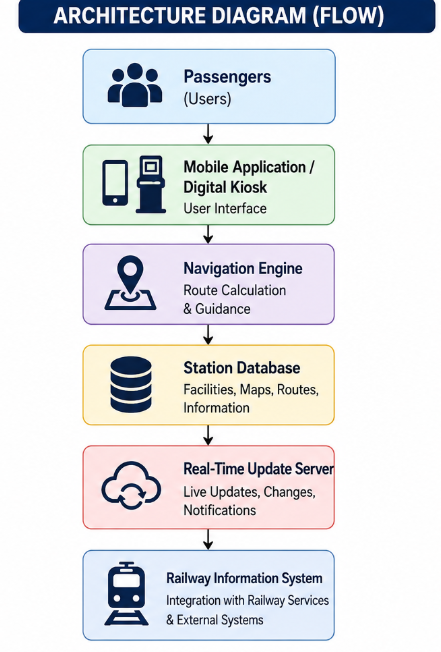
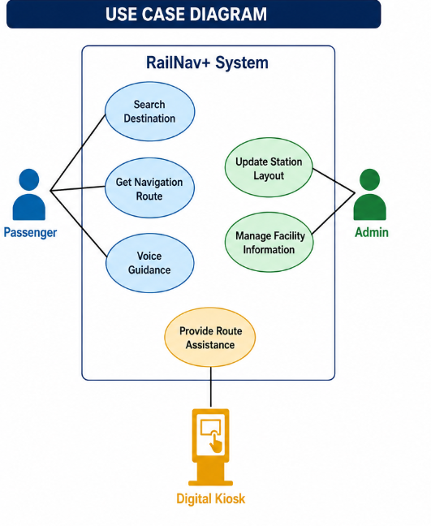

# SIH-1710: RailNav+ – Smart Navigation System for Railway Stations

## Problem Title

**SIH 1710: Enhancing Navigation for Railway Station Facilities and Locations**

## Problem Creator's Organization

**Ministry of Railways**

---

# Problem Statement

Railway stations are complex environments with numerous facilities such as ticket counters, platforms, waiting halls, restrooms, food courts, inquiry counters, and exits. Passengers often face difficulties navigating these spaces, especially in large or unfamiliar stations. This confusion can lead to delays, congestion, missed connections, and a poor travel experience.

The objective of this project is to develop a smart navigation solution that assists passengers in locating facilities and destinations within railway station premises. The system should provide accurate directions, support accessibility features, and work across multiple platforms such as mobile applications and digital kiosks.

---

# Proposed Solution – RailNav+

RailNav+ is a multi-platform navigation system designed to provide passengers with a seamless and user-friendly experience while navigating railway stations.

The system offers:

* Interactive 3D station maps.
* Step-by-step indoor navigation.
* QR code-based location identification.
* Voice-guided assistance for visually impaired passengers.
* Wheelchair-friendly route suggestions.
* Digital kiosk support with touch-screen interfaces.
* Multilingual assistance.
* Real-time updates reflecting station layout changes.
* Integration with existing railway services.

This solution helps passengers quickly locate facilities and destinations while improving accessibility and reducing confusion.

---

# Objectives

* Improve passenger experience inside railway stations.
* Provide accurate and real-time navigation.
* Reduce confusion and congestion.
* Save passengers' time.
* Support elderly and differently-abled individuals.
* Enhance accessibility through inclusive design.

---

# Key Features

* 3D Interactive Maps
* Indoor Navigation
* QR Code Scanning
* Voice Guidance
* Accessibility Support
* Wheelchair-Friendly Routes
* Digital Kiosk Navigation
* Real-Time Updates
* Multilingual Support
* Integration with Railway Services

---

# Proposed Architecture

Passenger

↓

Mobile Application / Digital Kiosk

↓

Navigation Engine

↓

Station Database

↓

Real-Time Update Server

↓

Railway Information System

---

# Use Case Diagram

Actors:

* Passenger
* Admin
* Digital Kiosk

Use Cases:

### Passenger

* Search Destination
* Get Navigation Route
* Voice Guidance

### Admin

* Update Station Layout
* Manage Facility Information

### Digital Kiosk

* Provide Route Assistance

---

# Modules

## 1. User Module

* Search destinations.
* View station maps.
* Receive navigation instructions.

## 2. Accessibility Module

* Voice guidance for visually impaired users.
* Wheelchair-accessible route suggestions.

## 3. Digital Kiosk Module

* Touch-screen navigation.
* Route display assistance.

## 4. Admin Module

* Update facility information.
* Modify station layouts.
* Monitor system status.

---

# Technologies Used

## Frontend

* React.js
* HTML
* CSS
* JavaScript

## Backend

* Node.js
* Express.js

## Database

* MongoDB

## Additional Technologies

* Three.js
* QR Code Integration
* Text-to-Speech API
* Speech Recognition API

---

# Advantages

* Easy to use.
* Improves passenger convenience.
* Reduces navigation-related stress.
* Accessible to differently-abled passengers.
* Supports multiple platforms.
* Provides accurate directions.
* Enhances overall station efficiency.

---

# Future Enhancements

* Augmented Reality (AR) based indoor navigation.
* AI-powered chatbot assistance.
* Predictive crowd management.
* Wearable device integration.
* Personalized travel recommendations.

---

# Evaluation of Other Submissions

### Evaluation 1

The repository is well organized and clearly explains the proposed solution. Accessibility features are effectively addressed.

### Evaluation 2

The diagrams are informative and easy to understand. Additional details on real-time updates could further improve the proposal.

---

# References

1. Indian Railways Official Website
2. Smart India Hackathon Problem Statement
3. React.js Documentation
4. Node.js Documentation
5. MongoDB Documentation
6. Three.js Documentation

---

# Conclusion

RailNav+ is an intelligent navigation solution that aims to transform the railway passenger experience. By combining real-time updates, interactive maps, voice assistance, and accessibility-focused features, the system enables passengers to navigate railway stations efficiently and confidently. The proposed solution promotes inclusivity, reduces confusion, and contributes to a smarter and more passenger-friendly railway ecosystem.
